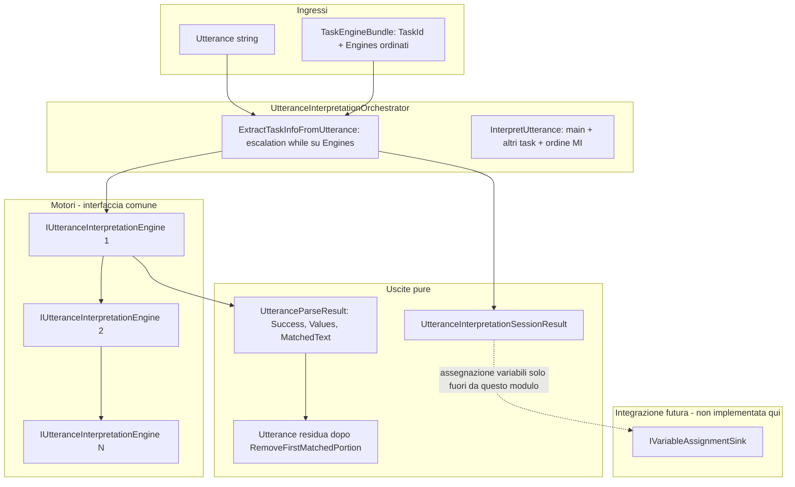

# Modulo UtteranceInterpretation (parallelo, isolato)

Questo cartella contiene **solo** tipi e logica nuovi. **Non** modifica `Parser.vb`, `ParserExtraction.vb`, `FlowOrchestrator` né altri file legacy.

---

## 1. Architettura logica

**Separazione parsing / assegnazione:** l’orchestratore **non** chiama `IVariableAssignmentSink`. Il chiamante esterno (futuro adapter) applica i valori alle variabili dopo aver letto `SingleTaskExtractionResult`.

---

## 2. Interfaccia motori (VB.NET)

- File: `IUtteranceInterpretationEngine.vb`
- Risultato: `UtteranceParseResult` con:
  - `Success As Boolean`
  - `Values As Dictionary(Of String, Object)`
  - `MatchedText As String`

---

## 3. Orchestratore — `ExtractTaskInfoFromUtterance`

- File: `UtteranceInterpretationOrchestrator.vb`
- Comportamento: per un task, lista di motori **ordinata**; `While` fino al primo `Success`; opzionalmente aggiorna `UtteranceAfterExtraction` rimuovendo `MatchedText` (costruttore `consumeMatched`).

---

## 4. `InterpretUtterance(main, otherTasks, utterance, order)`

- Stesso file: `InterpretUtterance`
- `MainFirstThenOthers`: prima `main`, poi ogni `other` in sequenza sul residuo.
- `OthersFirstThenMain`: prima tutti gli `other`, poi `main` sul residuo.

---

## 5. Strategia mixed-initiative multi-task

- Ordine controllato da `MixedInitiativeOrder`.
- Tra task “other”, ordine = **ordine della lista** `otherTasks` (priorità definita dall’host prima della chiamata).
- Ogni task può fallire (`Success = False`): il residuo può restare invariato per quel passo; nessuna eccezione forzata.

---

## 6. Strategia consumo utterance

- Modulo: `UtteranceRemainder.RemoveFirstMatchedPortion(full, matched)` — prima occorrenza, `Ordinal`.
- Se `MatchedText` è vuoto ma `Success = True`, il residuo non viene accorciato (evita perdita di testo).
- Strategie alternative (span, regex globale) possono essere aggiunte **in nuovi metodi** nello stesso modulo, senza toccare il legacy.

---

## 7. Integrazione non invasiva

| Aspetto | Approccio |
|--------|-----------|
| Convivenza | Il runtime attuale resta il default. Il nuovo modulo è libreria pura: nessun riferimento a `Parser`/`ProcessTurnHelpers`. |
| Task pilota | `PilotTaskGate.ShouldUseNewInterpreter(taskId, pilotTaskIds)` — gli id vengono dall’host (config). |
| Attivazione | In una fase futura, **un solo** punto di integrazione (es. handler dedicato o branch esplicito in un wrapper nuovo) legge il flag pilota e, se true, costruisce `IUtteranceInterpretationEngine` ad hoc e chiama l’orchestratore; altrimenti delega al percorso esistente **senza modificarne il codice**. |
| Rollout | 1 task pilota → più task → confronto log/telemetria → espansione id pilota. |

*Nessuna modifica a `FlowOrchestrator` è richiesta per compilare o usare questo modulo.*

---

## 8. Piano di migrazione (fasi)

1. **Interfacce** — fatto in questo modulo (`IUtteranceInterpretationEngine`, `IVariableAssignmentSink`, risultati).
2. **Orchestratore** — fatto (`UtteranceInterpretationOrchestrator`).
3. **matchedText** — già su `UtteranceParseResult`; implementazioni motore devono riempirlo quando possibile.
4. **Escalation N livelli** — già nel `While` su `engines`; aggiungere motori concreti come nuove classi in file separati.
5. **Mixed-initiative** — già `InterpretUtterance` + `MixedInitiativeOrder`.
6. **Task pilota** — implementare 1–2 classi motore + adapter sottile **fuori** da Parser legacy.
7. **Altri task** — ampliare lista piloti e motori.
8. **Deprecazione parser sparsi** — solo quando il nuovo percorso copre i casi; **non** obbligatoria e **non** parte di questo commit.

---

## 9. Regole di stile (rispettate nel codice)

- VB.NET lineare, `Option Strict On`, nessun pattern enterprise.
- Nessuna dipendenza da `Parser`/`FlowOrchestrator` dentro questo modulo.
- Nessun side effect nascosto: l’orchestratore non scrive stato di dialogo né variabili.

---

## TaskEngineBundle (nota implementativa)

Le proprietà automatiche nel costruttore VB potevano lasciare `TaskId` non valorizzato in lettura; il tipo usa **campi `ReadOnly` privati** e proprietà espliciti.

## File creati

| File | Ruolo |
|------|--------|
| `UtteranceParseResult.vb` | DTO esito motore |
| `IUtteranceInterpretationEngine.vb` | Contratto motore |
| `IVariableAssignmentSink.vb` | Estensione futura assegnazione |
| `UtteranceRemainder.vb` | Rimozione porzione matchata |
| `TaskEngineBundle.vb` | TaskId + motori |
| `MixedInitiativeOrder.vb` | Enum ordine MI |
| `SingleTaskExtractionResult.vb` | Esito per un task |
| `UtteranceInterpretationSessionResult.vb` | Esito sessione completa |
| `UtteranceInterpretationOrchestrator.vb` | Escalation + orchestrazione MI |
| `PilotTaskGate.vb` | Gate task pilota |
| `LastWordUtteranceEngine.vb` | Motore demo: ultima parola (regex) |

Progetto placeholder: `VBNET\UtteranceInterpretation.Demo\` (console minimale; integrazione reale via ApiServer/compilatore).
